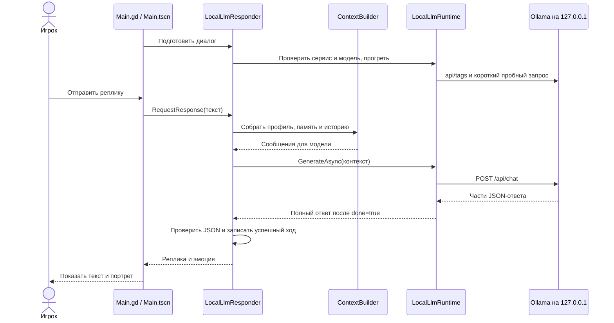

# NpcWithLLM

Небольшая 2D-сцена Godot 4.7 на GDScript для диалога игрока с NPC Иваном.

В каталоге build/client-delivery собираются архив исходного проекта Godot и переносимая Windows-версия с локальной Ollama и моделью. Короткая инструкция для игрока включается в Windows-пакет как README.md; полный исходный архив собирается скриптом Package-GodotProject.ps1.


## Сборка автономного Windows-пакета с нуля

Эта инструкция рассчитана на Windows 10/11 x64 и PowerShell 7. Она собирает папку, которую можно
перенести на другой Windows-компьютер: в ней будут игра, Ollama и веса модели. Сборка для macOS или
Linux этим скриптом не поддерживается.

Для готового пакета понадобится около 20 ГБ свободного места на диске: модель сначала скачивается в
локальное хранилище Ollama, а затем копируется в папку результата. Готовая папка занимает примерно
9,3 ГБ. Веса модели в Git-репозитории не хранятся. Производительность модели проверялась на RTX 4070
Ti с 12 ГБ VRAM; работа на видеокарте с 8 ГБ VRAM пока не подтверждена.

### 1. Установите необходимые программы

- [Git for Windows](https://git-scm.com/download/win) — нужен, если будете скачивать проект командой
  `git clone`. Вместо Git можно скачать ZIP репозитория по ссылке ниже.
- [PowerShell 7](https://learn.microsoft.com/powershell/scripting/install/install-powershell-on-windows).
  Если в Windows доступна команда `winget`, откройте старый Windows PowerShell или `cmd` и выполните
  `winget install --id Microsoft.PowerShell --source winget`. В дальнейших шагах запускайте именно
  **PowerShell 7** (`pwsh`), а не «Windows PowerShell» версии 5.1.
- [Godot 4.7.2 для Windows x86_64](https://godotengine.org/download/archive/4.7.2-stable/) — выберите
  обычную сборку **Windows - x86_64**, не вариант `.NET`.

### 2. Скачайте проект

Откройте PowerShell 7 и выполните:

```powershell
New-Item -ItemType Directory -Path "$HOME\source" -Force | Out-Null
Set-Location "$HOME\source"
git clone https://github.com/FursiK911/NpcWithLLM.git
Set-Location .\NpcWithLLM
```

Без Git можно открыть [страницу репозитория](https://github.com/FursiK911/NpcWithLLM), нажать **Code →
Download ZIP**, распаковать архив и открыть PowerShell 7 в появившейся папке `NpcWithLLM-main`.
Перед следующими шагами убедитесь, что в текущей папке лежит файл `project.godot`:

```powershell
Get-Item .\project.godot
```

### 3. Подготовьте Godot и шаблоны экспорта

1. Распакуйте архив Godot, например, в `C:\Godot`.
2. Запустите редактор Godot и откройте `project.godot` из папки репозитория. При первом запуске
   Godot может попросить импортировать проект — дождитесь окончания.
3. В редакторе откройте **Editor → Manage Export Templates…** и установите шаблоны для той же версии
   Godot. Для Windows выберите обычные шаблоны, не `.NET`-шаблоны. Установка шаблонов также описана в
   [документации Godot](https://docs.godotengine.org/en/4.7/tutorials/export/exporting_projects.html).

В этом руководстве предполагается, что консольный исполняемый файл Godot находится здесь:
`C:\Godot\Godot_v4.7.2-stable_win64_console.exe`. Если вы распаковали Godot в другое место,
запомните фактический путь к файлу `*_console.exe`: он понадобится на шаге 6.

### 4. Скачайте закреплённую версию Ollama

Скрипт сборки принимает только Ollama **0.32.15** и проверяет SHA-256 исполняемого файла. Не берите
последнюю версию с обычной страницы загрузки: версия должна совпадать с проверенной.

В PowerShell 7 скачайте официальный Windows x64 архив из
[релиза Ollama 0.32.15](https://github.com/ollama/ollama/releases/tag/v0.32.15) и распакуйте его в
папку пользователя:

```powershell
$ollamaDir = Join-Path $env:LOCALAPPDATA 'Programs\Ollama-0.32.15'
$ollamaZip = Join-Path $env:TEMP 'ollama-windows-amd64.zip'
Invoke-WebRequest `
    -Uri 'https://github.com/ollama/ollama/releases/download/v0.32.15/ollama-windows-amd64.zip' `
    -OutFile $ollamaZip
New-Item -ItemType Directory -Path $ollamaDir -Force | Out-Null
Expand-Archive -LiteralPath $ollamaZip -DestinationPath $ollamaDir -Force
```

В папке `$ollamaDir` должны находиться `ollama.exe` и папка `lib`. Проверьте версию файла: команда
должна вывести SHA-256 ниже. Скрипт сборки выполнит ту же проверку автоматически.

```powershell
(Get-FileHash -LiteralPath (Join-Path $ollamaDir 'ollama.exe') -Algorithm SHA256).Hash
```

```text
0A9D42EABC59FDAFDE8D2D3E7964F6050B31A17B3E3795BFACB367C12DF790F4
```

Если файлы архива распаковались во вложенную папку, задайте `$ollamaDir` как путь к папке, где прямо
лежат `ollama.exe` и `lib`. Если Ollama уже запущена на компьютере, сначала завершите её через значок
в области уведомлений Windows, чтобы освободить локальный порт `11434`.

### 5. Скачайте и подготовьте модель

Сборка включает модель `Qwen3.5 9B Q4_K_M` от
[bartowski на Hugging Face](https://huggingface.co/bartowski/Qwen_Qwen3.5-9B-GGUF). Для неё требуется
скачать около 6,17 ГБ. Игра ожидает точное имя `qwen35-9b-q4km-bartowski:latest`, поэтому после
загрузки мы создадим для модели такой короткий тег.

Откройте первое окно PowerShell 7 и запустите локальную службу Ollama. Не закрывайте это окно, пока
модель скачивается в следующем шаге:

```powershell
$ollamaDir = Join-Path $env:LOCALAPPDATA 'Programs\Ollama-0.32.15'
$env:OLLAMA_MODELS = Join-Path $env:USERPROFILE '.ollama\models'
& (Join-Path $ollamaDir 'ollama.exe') serve
```

Откройте **второе** окно PowerShell 7, перейдите в папку репозитория и выполните:

```powershell
$ollamaDir = Join-Path $env:LOCALAPPDATA 'Programs\Ollama-0.32.15'
$ollama = Join-Path $ollamaDir 'ollama.exe'
$sourceModel = 'hf.co/bartowski/Qwen_Qwen3.5-9B-GGUF:Q4_K_M'
& $ollama pull $sourceModel
& $ollama cp $sourceModel 'qwen35-9b-q4km-bartowski:latest'
& $ollama list
```

В списке должна появиться строка `qwen35-9b-q4km-bartowski:latest`. Команды `pull` и `cp` используют
официальный [способ запуска этой модели через Ollama](https://huggingface.co/bartowski/Qwen_Qwen3.5-9B-GGUF).
После завершения загрузки вернитесь в первое окно и нажмите `Ctrl+C`, чтобы остановить службу.

### 6. Соберите игру

В окне PowerShell 7 перейдите в корень репозитория — туда, где лежит `project.godot` — и выполните:

```powershell
$godot = 'C:\Godot\Godot_v4.7.2-stable_win64_console.exe'
$ollamaDir = Join-Path $env:LOCALAPPDATA 'Programs\Ollama-0.32.15'
$modelsDir = Join-Path $env:USERPROFILE '.ollama\models'
.\Build-WindowsPackage.ps1 `
    -GodotExecutablePath $godot `
    -OllamaInstallDirectory $ollamaDir `
    -OllamaModelsDirectory $modelsDir
```

Если Godot распакован в другое место, поменяйте значение `$godot`. Сборка проверяет GDScript,
импортирует ресурсы Godot, экспортирует Windows x64 игру, копирует Ollama и модель, затем проверяет
целостность файлов. Успешное завершение покажет путь к готовому пакету:
`build/client-delivery/windows-standalone`.

### 7. Запустите или передайте готовую игру

Запустите `build\client-delivery\windows-standalone\NpcWithLLM.exe`. Для переноса на другой компьютер скопируйте или
заархивируйте **всю папку** `windows-standalone`: одного `.exe` недостаточно. Внутри должны остаться
`NpcWithLLM.exe` и `tools\ollama`. На компьютере игрока отдельно
устанавливать Ollama или скачивать модель не нужно: они уже лежат рядом с игрой. В папке пакета есть
краткая инструкция README.md.

Чтобы передать исходный проект Godot, запустите Package-GodotProject.ps1. По умолчанию он создаёт
build/client-delivery/NpcWithLLM-godot-project-final.zip. Архив содержит GDScript-приложение, ресурсы,
инструкции, модельное обоснование и проверки без .NET-зависимостей.

Чтобы передать готовую Windows-игру одним файлом, после сборки запустите Package-WindowsClient.ps1.
Он создаёт build/client-delivery/NpcWithLLM-windows-standalone.zip без сжатия игровых и модельных
данных; архив занимает примерно 9,3 ГБ.

### Если что-то не получилось

- **`Требуется обычный Godot 4.7.2 без .NET`** — проверьте, что скачана стандартная сборка Windows
  x86_64 версии 4.7.2.
- **Не найдены export templates / шаблоны экспорта** — установите обычные шаблоны через
  **Editor → Manage Export Templates…** в редакторе Godot.
- **`Версия Ollama не совпала`** — скачайте именно `ollama-windows-amd64.zip` из релиза `v0.32.15` и
  проверьте SHA-256 командой из шага 4.
- **Модель не найдена** — запустите `ollama list` из шага 5. В списке должно быть имя
  `qwen35-9b-q4km-bartowski:latest`; проверьте, что при запуске сборки параметр
  `-OllamaModelsDirectory` указывает на ту же папку `models`.
- **Папка результата уже занята или неполная** — выберите новое имя результата, например, добавьте к
  команде сборки `-OutputDirectory 'build/client-delivery/windows-standalone-2'`.
- **Ошибка при запуске тестов** — укажите путь к обычному Godot 4.x параметром
  `-GodotExecutablePath` или через переменную `GODOT_EXECUTABLE`.

## Как устроен проект

Это приложение Godot 4.7 на GDScript. Сцена и сигналы связывают UI с обработчиком диалога; память,
история и построение контекста отделены от HTTP-интеграции с локальной Ollama. Для запуска игры не
нужны Godot .NET, C# или .NET SDK.

### Где находятся основные части

| Файл или папка | За что отвечает |
| --- | --- |
| [`project.godot`](project.godot) | Настройки Godot и название главной сцены, которая запускается при старте. |
| [`Main.tscn`](Main.tscn) | Главная сцена: окно диалога, поле ввода, вступление, фон, портреты и узел `ChatResponder`. |
| [`Scripts/Main.gd`](Scripts/Main.gd) | Работа интерфейса: ввод сообщения, ожидание, ответ персонажа и портрет по эмоции. |
| [`Scripts/ChatResponder.gd`](Scripts/ChatResponder.gd) | Сигнальный интерфейс UI и адаптеров диалога. |
| [`Scripts/Dialogue/LocalLlmResponder.gd`](Scripts/Dialogue/LocalLlmResponder.gd) | Готовит модель, собирает контекст, запрашивает ответ и обновляет историю с памятью. |
| [`Scripts/Dialogue/LocalLlmRuntime.gd`](Scripts/Dialogue/LocalLlmRuntime.gd) | Проверяет сервис и модель, выполняет HTTP-запросы к Ollama и разбирает поток JSON. |
| [`Scripts/Dialogue/OllamaServerController.gd`](Scripts/Dialogue/OllamaServerController.gd) | Переиспользует отвечающий endpoint или запускает bundled Ollama и останавливает только собственный процесс. |
| [`Scripts/Dialogue/ContextBuilder.gd`](Scripts/Dialogue/ContextBuilder.gd) | Собирает инструкции, профиль Ивана, обстановку, память, историю и новую реплику. |
| [`Scripts/Dialogue/LocalLlmRequestBuilder.gd`](Scripts/Dialogue/LocalLlmRequestBuilder.gd) и [`Scripts/Dialogue/GeneratedCharacterResponse.gd`](Scripts/Dialogue/GeneratedCharacterResponse.gd) | Формируют запрос со схемой JSON и проверяют `message` и `emotion` в ответе. |
| [`NpcProfile.tres`](NpcProfile.tres) и [`Scripts/Dialogue/NpcProfile.gd`](Scripts/Dialogue/NpcProfile.gd) | Данные персонажа. `player_introduction` показывается игроку, `situation` описывает сцену для модели. |
| [`LocalLlmConfig.tres`](LocalLlmConfig.tres) и [`Scripts/Dialogue/LocalLlmConfig.gd`](Scripts/Dialogue/LocalLlmConfig.gd) | Настройки адреса, модели, генерации, тайм-аута и лимитов истории в Godot `Resource`. |
| [`Scripts/Dialogue/DialogueHistory.gd`](Scripts/Dialogue/DialogueHistory.gd) и [`Scripts/Dialogue/NpcMemory.gd`](Scripts/Dialogue/NpcMemory.gd) | История последних реплик и распознанные имя и профессия игрока; обе существуют только в памяти процесса. |
| [`Art/`](Art/) | Фон мастерской и изображения персонажа для разных эмоций и состояний. |
| [`Tests/`](Tests/) | GDScript regression и smoke-сцены, а также PowerShell-проверки модели и Ollama. |
| [`docs/adr/`](docs/adr/) | Короткие записи о важных решениях по устройству и поведению проекта. |
| [`Build-WindowsPackage.ps1`](Build-WindowsPackage.ps1) и [`export_presets.cfg`](export_presets.cfg) | Скрипт и настройки экспорта автономной Windows-сборки. |

Короткий словарь: `.gd` — скрипт GDScript; `.tscn` — сцена Godot, то есть дерево узлов интерфейса и
связи между ними; `.tres` — сохранённый ресурс с данными или настройками; `res://` в коде означает
«путь от корня проекта», где лежит `project.godot`. Например, `res://Art/...` указывает на файл внутри
папки `Art` этого репозитория.

В текущих настройках история хранит целые пары «сообщение игрока — ответ Ивана»: не больше 32
сообщений (16 пар) и 8 000 символов; при превышении лимита удаляются самые старые пары. Память пока
распознаёт только простые фразы вроде «меня зовут Алексей», «я работаю механиком», «моя профессия —
механик» или «я тоже механик». Это не обучение модели: найденные имя и профессия просто добавляются в контекст
следующего запроса.

Папки `.godot/`, `bin/`, `obj/` и `build/` исключены из Git. `.godot/` содержит промежуточные файлы
редактора, `build/` — результаты экспорта и пакетирования. Необязательный C#-оценщик из полного dev-репозитория не включён в клиентский архив и не участвует в игре.

### Что происходит при запуске и в диалоге

1. Godot открывает [`Main.tscn`](Main.tscn), указанную в `project.godot`. Сцена назначает узлу
   `ChatResponder` скрипт `LocalLlmResponder` и подключает к нему `NpcProfile.tres` и
   `LocalLlmConfig.tres`.
2. `Main.gd` загружает фон и портреты, показывает вступление и просит обработчик подготовить диалог.
   Во время запуска Ollama и загрузки модели интерфейс показывает этап подготовки. Поле ввода становится
   доступным после закрытия вступления и успешной подготовки модели; если подготовка не удалась,
   причина остаётся видимой, а отправка сообщений заблокирована.
3. `LocalLlmRuntime` через `OllamaServerController` проверяет `http://127.0.0.1:11434`. Если там уже
   отвечает Ollama, игра использует её; иначе запускает поставленную рядом с игрой Ollama. Затем
   проверяется наличие точного тега модели из `LocalLlmConfig`, и выполняется короткий пробный запрос,
   чтобы загрузить модель в память до начала разговора. Игра не скачивает модель автоматически.
4. Когда игрок нажимает **Enter** или кнопку отправки, `Main.gd` передаёт текст в
   `LocalLlmResponder`. `Shift+Enter` оставляет перенос строки в поле ввода.
5. `ContextBuilder` готовит для модели единый контекст: характер и знания Ивана, описание ситуации,
   распознанные факты о собеседнике, последние реплики и новое сообщение.
6. `LocalLlmRuntime` отправляет этот контекст на локальный `/api/chat`. Запрос требует JSON с репликой
   `message` и одной из эмоций `emotion`. Ответ может приходить частями, но игра показывает его только
   после завершения потока и проверки JSON.
7. Если ответ корректен, `LocalLlmResponder` добавляет ход в ограниченную историю, обновляет простую
   память о собеседнике и сообщает результат интерфейсу. `Main.gd` показывает реплику и выбирает
   портрет по эмоции. Если запрос или разбор не удался, ошибка появляется в статусе, а введённый текст
   остаётся в поле для повторной отправки.
8. При закрытии игры останавливается только процесс Ollama, который запустила сама игра. Уже
   работавший до неё локальный сервис остаётся запущенным.



История и память существуют только пока работает игра: текущая версия не записывает их на диск и не
восстанавливает после перезапуска. Текст диалога отправляется на `127.0.0.1`, то есть локальной Ollama
на этом же компьютере, а не в облачный сервис.

### Что менять для своих задач

- Чтобы поменять имя, характер, отношение к игроку или факты о сцене, редактируйте поля в
  [`NpcProfile.tres`](NpcProfile.tres). `player_introduction` — видимый текст вступления; `situation` —
  контекст, который получает модель.
- Чтобы поменять модель или параметры, редактируйте [`LocalLlmConfig.tres`](LocalLlmConfig.tres).
  Ресурс задаёт `base_url`, `endpoint_path`, `model_name`, `timeout_seconds`, `temperature`, `top_p`,
  `max_tokens`, `context_tokens`, `presence_penalty`, `max_history_messages` и
  `max_history_characters`.
- Чтобы поменять расположение элементов UI, редактируйте [`Main.tscn`](Main.tscn); чтобы изменить
  обработку Enter, статусы или соответствие эмоций портретам — [`Scripts/Main.gd`](Scripts/Main.gd).
- Чтобы заменить изображения, положите файлы в [`Art/`](Art/) и обновите пути загрузки в `Main.gd`.
- Чтобы изменить Windows-экспорт и состав готовой папки, смотрите
  [`export_presets.cfg`](export_presets.cfg) и [`Build-WindowsPackage.ps1`](Build-WindowsPackage.ps1).

## Текущий статус

Сцена использует `LocalLlmResponder` и локальную Ollama с
`Qwen3.5 9B Q4_K_M`. Запрос требует структурированный JSON по JSON Schema; игра проверяет ответ и
показывает реплику и эмоцию только после его полного разбора.
Настройки подключения, модели, timeout, генерации и лимитов по умолчанию заданы в
`Scripts/Dialogue/LocalLlmConfig.gd`; `LocalLlmConfig.tres` явно задаёт значения, используемые в
сцене.
UI не знает о HTTP или JSON; он обращается к обработчику через `ChatResponder`. Подмены и локальный
HTTP fixture используются только в smoke-тестах.

Профиль персонажа живёт в одном месте: `NpcProfile.tres` хранит семь свойств персоны, короткое
вступление игроку и более полный контекст `Situation`, который получает NPC. Вступление описывает
только видимую сцену при входе; мысли и намерения персонажа остаются в `Situation`. На этот ресурс
ссылается узел `ChatResponder` в `Main.tscn`, а GDScript-smoke проверяет привязку этого профиля.
Имена ключей в блоке `[resource]` совпадают с экспортированными свойствами GDScript (`npc_name`,
`speech_style`, `situation`). Совпадение ключей проверяет
`Tests/NpcProfileRead.Tests.ps1`, а привязку профиля к сцене — smoke-сцена.

По умолчанию `Scripts/Dialogue/LocalLlmConfig.gd` выбирает модель
`qwen35-9b-q4km-bartowski:latest`.
В 32-ходовой оценке со схемой JSON она получила 5,5/10; без схемы игровой парсер отклонил ответ на
втором ходу. Оценка и полный диалог записаны в
[отчёте](docs/model-evaluation/qwen3.5-9b-q4km-evaluation.md). Проверка выполнена
на RTX 4070 Ti с 12 ГБ VRAM; работу на целевой карте с 8 ГБ она не подтверждает. Qwen оставлена
экспериментальным кандидатом по результату этой диагностической беседы, а не как доказанно лучшая
модель. JSON Schema нужна, чтобы выдерживать контракт ответа, хотя она не устраняет ошибки в
содержании.
Веса не входят в репозиторий, но standalone Windows-пакет включает их вместе с Ollama. Игроку не нужно
устанавливать или вручную запускать Ollama: игра незаметно поднимает bundled-процесс и завершает его
при закрытии игры. Уже работающий внешний endpoint переиспользуется и не останавливается игрой.

При старте игра проверяет локальный endpoint на `127.0.0.1:11434` и прогревает модель. Запросы
ограничивают поля ответа схемой JSON с `message` и `emotion`; текст диалога остаётся на компьютере.

Ожидаемый SHA-256 CLI версии Ollama 0.32.15:
`0A9D42EABC59FDAFDE8D2D3E7964F6050B31A17B3E3795BFACB367C12DF790F4`.

### Что входит в Windows-пакет

Скрипт [Build-WindowsPackage.ps1](Build-WindowsPackage.ps1) экспортирует игру GDScript обычным Godot,
затем размещает Ollama
CLI с GPU-библиотеками и локальную модель в `build/client-delivery/windows-standalone`. Он проверяет SHA-256 Ollama,
модели и упакованных файлов. Для другой модели поменяйте `model_name` в `LocalLlmConfig.tres`, затем
загрузите её в Ollama под тем же именем и соберите пакет заново.

Изолированная headless-проверка lifecycle-контроллера без установленной Ollama: повторное
использование внешнего endpoint, ошибка при отсутствии bundled executable, блокировка executable с
неверным SHA-256 и завершение дерева тестовых процессов на Windows:

```text
pwsh -NoProfile -File Tests/OllamaLifecycleSmoke.ps1
```

Для проверки GDScript требуется обычный Godot 4.x через `-GodotExecutablePath` или
`GODOT_EXECUTABLE`. Чтобы отдельно проверить запуск и остановку настоящей bundled Ollama на
временном loopback-порту, передайте ей исполняемый файл и каталог модели:

```powershell
pwsh -NoProfile -File Tests/OllamaLifecycleSmoke.ps1 `
    -GodotExecutablePath 'C:\Godot\Godot_v4.7.2-stable_win64_console.exe' `
    -OllamaExecutablePath 'build/client-delivery/windows-standalone/tools/ollama/ollama.exe' `
    -OllamaModelsDirectory 'build/client-delivery/windows-standalone/tools/ollama/models'
```

Этот дополнительный вариант запускает Ollama и затем проверяет, что игра завершила свой процесс и
endpoint перестал отвечать.

Проверка тега из `LocalLlmConfig.tres` и реального запроса `/api/chat`:

```text
pwsh -NoProfile -File Tests/OllamaConfiguredModelSmoke.ps1
```

`LocalLlmResponder` использует `LocalLlmRuntime` для запросов к Ollama: он отправляет `POST` на
`/api/chat` с `stream: true`, `think: false` и JSON Schema ответа. Контекст включает персону,
память персонажа, ограниченную историю и сообщение игрока; URL принимает только loopback;
полный текст диалога не пишется в debug log;
в лог попадают только состояние запроса, endpoint, тип ошибки и техническая причина.

## Тесты и проверка качества

Сквозной сценарий Tests/Run-CleanWindowsSmoke.ps1 проверяет GDScript-проект, ZIP-архив исходников и
автономный Windows-пакет без Godot .NET. Запустите его из PowerShell 7 с параметром
GodotExecutablePath, указав обычный консольный Godot 4.7.2.

Запустите импорт, GDScript regression и smoke-сцены стандартным Godot 4.x:

```powershell
pwsh -NoProfile -File Tests/Run-GdscriptTests.ps1 `
    -GodotExecutablePath 'C:\Godot\Godot_v4.7.2-stable_win64_console.exe'
```

Проверки UI, памяти, истории, контекста, схемы JSON, полного HTTP-пути `LocalLlmRuntime` и
поведения контроллера Ollama выполняются в headless Godot. Для игры и этих проверок не нужны
`.NET SDK`, Godot .NET и Pester.

`Tests/DialogueSmoke.tscn` — сцены ручного smoke-проверок в окне Godot.

## Направление проекта

Демонстрация уже подключает UI к локальной модели, передаёт ей контекст персонажа и отдельную память,
а историю ограничивает по количеству сообщений и символов. Для дальнейшего развития стоит проверить
фактическое потребление VRAM на целевой 8-ГБ карте, улучшить выделение пользовательских фактов и
точнее распределять токенный бюджет контекста.
