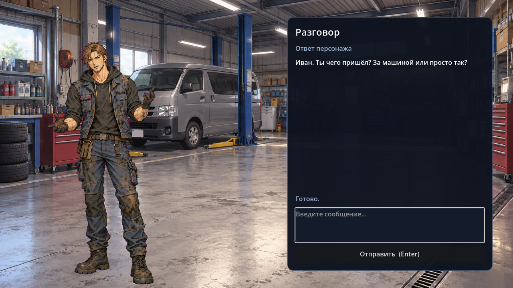

# NpcWithLLM

Небольшая 2D-сцена Godot 4.7 C# для диалога игрока с placeholder-NPC Иваном.



## Сборка автономного Windows-пакета с нуля

Эта инструкция рассчитана на Windows 10/11 x64 и PowerShell 7. Она собирает папку, которую можно
перенести на другой Windows-компьютер: в ней будут игра, Ollama и веса модели. Сборка для macOS или
Linux этим скриптом не поддерживается.

Для готового пакета понадобится около 20 ГБ свободного места на диске: модель сначала скачивается в
локальное хранилище Ollama, а затем копируется в папку результата. Готовая папка занимает примерно
9,3 ГБ. Веса модели в Git-репозитории не хранятся. Производительность модели проверялась на RTX 4070
Ti с 12 ГБ VRAM; работа на видеокарте с 8 ГБ VRAM пока не подтверждена.

### 1. Установите необходимые программы

- [Git for Windows](https://git-scm.com/download/win) — нужен, если будете скачивать проект командой
  `git clone`. Вместо Git можно скачать ZIP репозитория по ссылке ниже.
- [PowerShell 7](https://learn.microsoft.com/powershell/scripting/install/install-powershell-on-windows).
  Если в Windows доступна команда `winget`, откройте старый Windows PowerShell или `cmd` и выполните
  `winget install --id Microsoft.PowerShell --source winget`. В дальнейших шагах запускайте именно
  **PowerShell 7** (`pwsh`), а не «Windows PowerShell» версии 5.1.
- [.NET 8 SDK для Windows x64](https://dotnet.microsoft.com/download/dotnet/8.0) — на странице выберите
  установщик SDK для Windows x64. Нужен именно SDK, не только Runtime.
- [Godot .NET 4.7.2](https://godotengine.org/download/archive/4.7.2-stable/) — на странице загрузок
  выберите **Windows - .NET - x86_64**. Обычная версия Godot без `.NET` не подойдёт, потому что игра
  написана на C#.

### 2. Скачайте проект

Откройте PowerShell 7 и выполните:

```powershell
New-Item -ItemType Directory -Path "$HOME\source" -Force | Out-Null
Set-Location "$HOME\source"
git clone https://github.com/FursiK911/NpcWithLLM.git
Set-Location .\NpcWithLLM
```

Без Git можно открыть [страницу репозитория](https://github.com/FursiK911/NpcWithLLM), нажать **Code →
Download ZIP**, распаковать архив и открыть PowerShell 7 в появившейся папке `NpcWithLLM-main`.
Перед следующими шагами убедитесь, что в текущей папке лежит файл `project.godot`:

```powershell
Get-Item .\project.godot
```

### 3. Подготовьте Godot и шаблоны экспорта

1. Распакуйте архив Godot, например, в `C:\Godot`.
2. Запустите редактор Godot .NET и откройте `project.godot` из папки репозитория. При первом запуске
   Godot может попросить импортировать проект — дождитесь окончания.
3. В редакторе откройте **Editor → Manage Export Templates…** и установите шаблоны для той же версии
   Godot. Для Windows выберите .NET-шаблоны. Установка шаблонов также описана в
   [документации Godot](https://docs.godotengine.org/en/4.7/tutorials/export/exporting_projects.html).

В этом руководстве предполагается, что консольный исполняемый файл Godot находится здесь:
`C:\Godot\Godot_v4.7.2-stable_mono_win64_console.exe`. Если вы распаковали Godot в другое место,
запомните фактический путь к файлу `*_console.exe`: он понадобится на шаге 6.

### 4. Скачайте закреплённую версию Ollama

Скрипт сборки принимает только Ollama **0.32.15** и проверяет SHA-256 исполняемого файла. Не берите
последнюю версию с обычной страницы загрузки: версия должна совпадать с проверенной.

В PowerShell 7 скачайте официальный Windows x64 архив из
[релиза Ollama 0.32.15](https://github.com/ollama/ollama/releases/tag/v0.32.15) и распакуйте его в
папку пользователя:

```powershell
$ollamaDir = Join-Path $env:LOCALAPPDATA 'Programs\Ollama-0.32.15'
$ollamaZip = Join-Path $env:TEMP 'ollama-windows-amd64.zip'
Invoke-WebRequest `
    -Uri 'https://github.com/ollama/ollama/releases/download/v0.32.15/ollama-windows-amd64.zip' `
    -OutFile $ollamaZip
New-Item -ItemType Directory -Path $ollamaDir -Force | Out-Null
Expand-Archive -LiteralPath $ollamaZip -DestinationPath $ollamaDir -Force
```

В папке `$ollamaDir` должны находиться `ollama.exe` и папка `lib`. Проверьте версию файла: команда
должна вывести SHA-256 ниже. Скрипт сборки выполнит ту же проверку автоматически.

```powershell
(Get-FileHash -LiteralPath (Join-Path $ollamaDir 'ollama.exe') -Algorithm SHA256).Hash
```

```text
0A9D42EABC59FDAFDE8D2D3E7964F6050B31A17B3E3795BFACB367C12DF790F4
```

Если файлы архива распаковались во вложенную папку, задайте `$ollamaDir` как путь к папке, где прямо
лежат `ollama.exe` и `lib`. Если Ollama уже запущена на компьютере, сначала завершите её через значок
в области уведомлений Windows, чтобы освободить локальный порт `11434`.

### 5. Скачайте и подготовьте модель

Сборка включает модель `Qwen3.5 9B Q4_K_M` от
[bartowski на Hugging Face](https://huggingface.co/bartowski/Qwen_Qwen3.5-9B-GGUF). Для неё требуется
скачать около 6,17 ГБ. Игра ожидает точное имя `qwen35-9b-q4km-bartowski:latest`, поэтому после
загрузки мы создадим для модели такой короткий тег.

Откройте первое окно PowerShell 7 и запустите локальную службу Ollama. Не закрывайте это окно, пока
модель скачивается в следующем шаге:

```powershell
$ollamaDir = Join-Path $env:LOCALAPPDATA 'Programs\Ollama-0.32.15'
$env:OLLAMA_MODELS = Join-Path $env:USERPROFILE '.ollama\models'
& (Join-Path $ollamaDir 'ollama.exe') serve
```

Откройте **второе** окно PowerShell 7, перейдите в папку репозитория и выполните:

```powershell
$ollamaDir = Join-Path $env:LOCALAPPDATA 'Programs\Ollama-0.32.15'
$ollama = Join-Path $ollamaDir 'ollama.exe'
$sourceModel = 'hf.co/bartowski/Qwen_Qwen3.5-9B-GGUF:Q4_K_M'
& $ollama pull $sourceModel
& $ollama cp $sourceModel 'qwen35-9b-q4km-bartowski:latest'
& $ollama list
```

В списке должна появиться строка `qwen35-9b-q4km-bartowski:latest`. Команды `pull` и `cp` используют
официальный [способ запуска этой модели через Ollama](https://huggingface.co/bartowski/Qwen_Qwen3.5-9B-GGUF).
После завершения загрузки вернитесь в первое окно и нажмите `Ctrl+C`, чтобы остановить службу.

### 6. Соберите игру

В окне PowerShell 7 перейдите в корень репозитория — туда, где лежит `project.godot` — и выполните:

```powershell
$godot = 'C:\Godot\Godot_v4.7.2-stable_mono_win64_console.exe'
$ollamaDir = Join-Path $env:LOCALAPPDATA 'Programs\Ollama-0.32.15'
$modelsDir = Join-Path $env:USERPROFILE '.ollama\models'
.\Build-WindowsPackage.ps1 `
    -GodotExecutablePath $godot `
    -OllamaInstallDirectory $ollamaDir `
    -OllamaModelsDirectory $modelsDir
```

Если Godot распакован в другое место, поменяйте значение `$godot`. Сборка автоматически компилирует
C#, импортирует ресурсы Godot, экспортирует Windows x64 игру, копирует Ollama и модель, затем
проверяет целостность файлов. Успешное завершение покажет путь к готовому пакету:
`build/windows-standalone`.

### 7. Запустите или передайте готовую игру

Запустите `build\windows-standalone\NpcWithLLM.exe`. Для переноса на другой компьютер скопируйте или
заархивируйте **всю папку** `windows-standalone`: одного `.exe` недостаточно. Внутри должны остаться
`NpcWithLLM.exe`, `data_NpcWithLLM_windows_x86_64` и `tools\ollama`. На компьютере игрока отдельно
устанавливать Ollama или скачивать модель не нужно: они уже лежат рядом с игрой.

### Если что-то не получилось

- **`Требуется Godot .NET 4.7.2`** — проверьте, что скачан вариант Windows `.NET` x86_64 версии 4.7.2,
  а не обычный Godot и не другая версия.
- **Не найдены export templates / шаблоны экспорта** — установите .NET-шаблоны через
  **Editor → Manage Export Templates…** в редакторе Godot.
- **`Версия Ollama не совпала`** — скачайте именно `ollama-windows-amd64.zip` из релиза `v0.32.15` и
  проверьте SHA-256 командой из шага 4.
- **Модель не найдена** — запустите `ollama list` из шага 5. В списке должно быть имя
  `qwen35-9b-q4km-bartowski:latest`; проверьте, что при запуске сборки параметр
  `-OllamaModelsDirectory` указывает на ту же папку `models`.
- **Папка результата уже занята или неполная** — выберите новое имя результата, например, добавьте к
  команде сборки `-OutputDirectory 'build/windows-standalone-2'`.
- **`dotnet` не найден** — установите [.NET 8 SDK](https://dotnet.microsoft.com/download/dotnet/8.0),
  закройте и снова откройте PowerShell 7.

### Только скомпилировать C#

Если нужна лишь быстрая проверка компиляции исходников, а не автономная игра, выполните в корне репозитория:

```powershell
dotnet build .\NpcWithLLM.sln --configuration Release
```

Эта команда проверяет и компилирует C#-проект, но **не** создаёт готовую игру для передачи другому
человеку. Для этого выполните шаги 1–7 выше.

## Как устроен проект

Это приложение Godot с C#-кодом. Godot описывает сцену и визуальные элементы, а C#-скрипты обрабатывают
ввод, управляют диалогом и обращаются к локальной Ollama.

### Где находятся основные части

| Файл или папка | За что отвечает |
| --- | --- |
| [`project.godot`](project.godot) | Настройки Godot и название главной сцены, которая запускается при старте. |
| [`Main.tscn`](Main.tscn) | Главная сцена: окно диалога, поле ввода, вступление, фон, портреты и узел `ChatResponder`. |
| [`Scripts/Main.cs`](Scripts/Main.cs) | Работа интерфейса: ввод сообщения, блокировка кнопок на время ожидания, текст ответа и смена портрета. |
| [`Scripts/ChatResponder.cs`](Scripts/ChatResponder.cs) | Общий интерфейс между сценой и разными обработчиками диалога; определяет сигналы начала, успеха и ошибки. |
| [`Scripts/Dialogue/LocalLlmResponder.cs`](Scripts/Dialogue/LocalLlmResponder.cs) | Основной обработчик диалога: готовит модель, собирает контекст, запрашивает ответ и обновляет историю с памятью. |
| [`Scripts/Dialogue/LocalLlmRuntime.cs`](Scripts/Dialogue/LocalLlmRuntime.cs) | Проверяет модель и отправляет HTTP-запросы к Ollama на локальном компьютере. |
| [`Scripts/Dialogue/OllamaServerController.cs`](Scripts/Dialogue/OllamaServerController.cs) | Проверяет адрес Ollama; если локальный сервис не запущен, запускает Ollama из папки игры и останавливает только запущенный игрой процесс. |
| [`Scripts/Dialogue/ContextBuilder.cs`](Scripts/Dialogue/ContextBuilder.cs) | Собирает инструкции модели, профиль Ивана, обстановку, память, предыдущие реплики и новое сообщение игрока. |
| [`Scripts/Dialogue/LocalLlmRequest.cs`](Scripts/Dialogue/LocalLlmRequest.cs) | Формирует запрос и JSON Schema: модель должна вернуть поля `message` и `emotion`. |
| [`Scripts/Dialogue/GeneratedCharacterResponse.cs`](Scripts/Dialogue/GeneratedCharacterResponse.cs) | Разбирает и проверяет JSON-ответ до того, как он попадёт в интерфейс. |
| [`NpcProfile.tres`](NpcProfile.tres) и `Scripts/Dialogue/NpcProfile.cs` | Сведения о персонаже. `PlayerIntroduction` показывается игроку, `Situation` описывает сцену для модели. |
| [`LocalLlmConfig.tres`](LocalLlmConfig.tres) и [`Scripts/Dialogue/LocalLlmConfig.cs`](Scripts/Dialogue/LocalLlmConfig.cs) | Настройки подключения, модели, генерации и лимитов диалога. C#-класс задаёт значения по умолчанию, а `.tres` хранит настройки ресурса. В текущем `.tres` явно записаны адрес и путь API, модель, тайм-аут, параметры генерации и лимиты истории. |
| [`Scripts/Dialogue/DialogueHistory.cs`](Scripts/Dialogue/DialogueHistory.cs) и [`Scripts/Dialogue/NpcMemory.cs`](Scripts/Dialogue/NpcMemory.cs) | История последних реплик и распознанные имя и профессия игрока. Оба хранятся только в памяти процесса. |
| [`Art/`](Art/) | Фон мастерской и изображения персонажа для разных эмоций и состояний. |
| [`Tests/`](Tests/) | Ручные smoke-сцены, проверки C#-логики и PowerShell-скрипты проверки модели и Ollama. |
| [`docs/adr/`](docs/adr/) | Короткие записи о важных решениях по устройству и поведению проекта. |
| [`Build-WindowsPackage.ps1`](Build-WindowsPackage.ps1) и [`export_presets.cfg`](export_presets.cfg) | Скрипт и настройки экспорта автономной Windows-сборки. |

Короткий словарь: `.cs` — C#-код с логикой; `.tscn` — сцена Godot, то есть дерево узлов интерфейса и
связи между ними; `.tres` — сохранённый ресурс с данными или настройками; `res://` в коде означает
«путь от корня проекта», где лежит `project.godot`. Например, `res://Art/...` указывает на файл внутри
папки `Art` этого репозитория.

В текущих настройках история хранит целые пары «сообщение игрока — ответ Ивана»: не больше 32
сообщений (16 пар) и 8 000 символов; при превышении лимита удаляются самые старые пары. Память пока
распознаёт только простые фразы вроде «меня зовут Алексей» и «я работаю механиком» (или «моя
профессия — механик»). Это не обучение модели: найденные имя и профессия просто добавляются в контекст
следующего запроса.

Папки `.godot/`, `bin/`, `obj/` содержат промежуточные файлы редактора и компилятора. `build/` —
результаты сборки. Они создаются автоматически и исключены из Git; отправлять их вместе с исходным
репозиторием для его сборки не нужно.

### Что происходит при запуске и в диалоге

1. Godot открывает [`Main.tscn`](Main.tscn), указанную в `project.godot`. Сцена назначает узлу
   `ChatResponder` скрипт `LocalLlmResponder` и подключает к нему `NpcProfile.tres` и
   `LocalLlmConfig.tres`.
2. `Main.cs` загружает фон и портреты, показывает вступление и просит обработчик подготовить диалог.
   Поле ввода становится доступным после закрытия вступления и успешной подготовки модели.
3. `LocalLlmRuntime` через `OllamaServerController` проверяет `http://127.0.0.1:11434`. Если там уже
   отвечает Ollama, игра использует её; иначе запускает поставленную рядом с игрой Ollama. Затем
   проверяется наличие точного тега модели из `LocalLlmConfig`, и выполняется короткий пробный запрос,
   чтобы загрузить модель в память до начала разговора. Игра не скачивает модель автоматически.
4. Когда игрок нажимает **Enter** или кнопку отправки, `Main.cs` передаёт текст в
   `LocalLlmResponder`. `Shift+Enter` оставляет перенос строки в поле ввода.
5. `ContextBuilder` готовит для модели единый контекст: характер и знания Ивана, описание ситуации,
   распознанные факты о собеседнике, последние реплики и новое сообщение.
6. `LocalLlmRuntime` отправляет этот контекст на локальный `/api/chat`. Запрос требует JSON с репликой
   `message` и одной из эмоций `emotion`. Ответ может приходить частями, но игра показывает его только
   после завершения потока и проверки JSON.
7. Если ответ корректен, `LocalLlmResponder` добавляет ход в ограниченную историю, обновляет простую
   память о собеседнике и сообщает результат интерфейсу. `Main.cs` показывает реплику и выбирает
   портрет по эмоции. Если запрос или разбор не удался, ошибка появляется в статусе, а введённый текст
   остаётся в поле для повторной отправки.
8. При закрытии игры останавливается только процесс Ollama, который запустила сама игра. Уже
   работавший до неё локальный сервис остаётся запущенным.


История и память существуют только пока работает игра: текущая версия не записывает их на диск и не
восстанавливает после перезапуска. Текст диалога отправляется на `127.0.0.1`, то есть локальной Ollama
на этом же компьютере, а не в облачный сервис.

### Что менять для своих задач

- Чтобы поменять имя, характер, отношение к игроку или факты о сцене, редактируйте поля в
  [`NpcProfile.tres`](NpcProfile.tres). `PlayerIntroduction` — видимый текст вступления; `Situation` —
  контекст, который получает модель.
- Чтобы поменять модель или параметры по умолчанию, смотрите
  [`Scripts/Dialogue/LocalLlmConfig.cs`](Scripts/Dialogue/LocalLlmConfig.cs) и
  [`LocalLlmConfig.tres`](LocalLlmConfig.tres). В ресурсе сейчас заданы `BaseUrl`, `EndpointPath`,
  `ModelName`, `TimeoutSeconds`, `Temperature`, `TopP`, `MaxTokens`, `ContextTokens`,
  `PresencePenalty`, `MaxHistoryMessages` и `MaxHistoryCharacters`; C#-инициализаторы служат запасными
  значениями, если ресурс не задаёт какое-либо свойство. Упаковщик берёт `ModelName` из `.tres`, если
  он там записан; иначе использует значение по умолчанию из C#.
- Чтобы поменять расположение элементов UI, редактируйте [`Main.tscn`](Main.tscn); чтобы изменить
  обработку Enter, статусы или соответствие эмоций портретам — [`Scripts/Main.cs`](Scripts/Main.cs).
- Чтобы заменить изображения, положите файлы в [`Art/`](Art/) и обновите пути загрузки в `Main.cs`.
- Чтобы изменить Windows-экспорт и состав готовой папки, смотрите
  [`export_presets.cfg`](export_presets.cfg) и [`Build-WindowsPackage.ps1`](Build-WindowsPackage.ps1).

## Текущий статус

Сцена использует `LocalLlmResponder` и локальную Ollama с
`Qwen3.5 9B Q4_K_M`. Запрос требует структурированный JSON по JSON Schema; игра проверяет ответ и
показывает реплику и эмоцию только после его полного разбора.
Настройки подключения, модели, timeout, генерации и лимитов по умолчанию заданы в
`Scripts/Dialogue/LocalLlmConfig.cs`; `LocalLlmConfig.tres` явно задаёт значения, используемые в
сцене.
UI не знает о HTTP или JSON; он обращается к обработчику через `ChatResponder`.

Профиль персонажа живёт в одном месте: `NpcProfile.tres` хранит семь свойств персоны, короткое
вступление игроку и более полный контекст `Situation`, который получает NPC. Вступление описывает
только видимую сцену при входе; мысли и намерения персонажа остаются в `Situation`. На этот ресурс
ссылается узел `ChatResponder` в `Main.tscn`, и тот же файл читает
`Tests/Run-DialogueModelEvaluation.ps1`, поэтому прогон использует тот же контекст NPC, что и игра.
Имена ключей в блоке `[resource]` обязаны совпадать с именами C#-свойств (`Name`, `SpeechStyle`,
`Situation`): Godot 4.7 не приводит их к нижнему регистру, а несопавший ключ игнорируется молча, и
в ресурсе остаются значения по умолчанию из кода. Совпадение ключей проверяет
`Tests/NpcProfileRead.Tests.ps1`, а привязку профиля к сцене — smoke-сцена.

По умолчанию `Scripts/Dialogue/LocalLlmConfig.cs` выбирает модель
`qwen35-9b-q4km-bartowski:latest`.
В 32-ходовой оценке со схемой JSON она получила 5,5/10; без схемы игровой парсер отклонил ответ на
втором ходу. Оценка и полный диалог записаны в
[отчёте](.scratch/npc-local-llm-demo/reports/06-qwen3.5-9b-q4km-evaluation.md). Проверка выполнена
на RTX 4070 Ti с 12 ГБ VRAM; работу на целевой карте с 8 ГБ она не подтверждает.
Веса не входят в репозиторий, но standalone Windows-пакет включает их вместе с Ollama. Игроку не нужно
устанавливать или вручную запускать Ollama: игра незаметно поднимает bundled-процесс и завершает его
при закрытии игры. Уже работающий внешний endpoint переиспользуется и не останавливается игрой.

При старте игра проверяет локальный endpoint на `127.0.0.1:11434` и прогревает модель. Запросы
ограничивают поля ответа схемой JSON с `message` и `emotion`; текст диалога остаётся на компьютере.

Ожидаемый SHA-256 CLI версии Ollama 0.32.15:
`0A9D42EABC59FDAFDE8D2D3E7964F6050B31A17B3E3795BFACB367C12DF790F4`.

### Что входит в Windows-пакет

Скрипт [Build-WindowsPackage.ps1](Build-WindowsPackage.ps1) размещает игру, файлы Godot .NET, Ollama
CLI с GPU-библиотеками и локальную модель в `build/windows-standalone`. Он проверяет SHA-256 Ollama,
модели и упакованных файлов. Для другой модели поменяйте `ModelName` в `LocalLlmConfig.tres`, затем
загрузите её в Ollama под тем же именем и соберите пакет заново.

Windows-smoke жизненного цикла (повторное использование endpoint, проверка SHA-256, скрытый запуск
и завершение собственного процесса):

```text
pwsh -NoProfile -File Tests/OllamaLifecycleSmoke.ps1
```

По умолчанию сценарий использует bundled CLI, а при её отсутствии — `ollama.exe` из `PATH`. Для
проверки повтора endpoint Ollama должен отвечать на `127.0.0.1:11434`; собственный процесс для
проверки запускается на временном свободном порту.

Проверка тега из `LocalLlmConfig.tres` и реального запроса `/api/chat`:

```text
pwsh -NoProfile -File Tests/OllamaConfiguredModelSmoke.ps1
```

`LocalLlmResponder` использует `LocalLlmRuntime` для запросов к Ollama: он отправляет `POST` на
`/api/chat` с `stream: true`, `think: false` и JSON Schema ответа. Контекст включает персону,
память персонажа, ограниченную историю и сообщение игрока; URL принимает только loopback;
полный текст диалога не пишется в debug log;
в лог попадают только состояние запроса, endpoint, тип ошибки и техническая причина.

## Тесты и проверка качества

Сборка: `dotnet build NpcWithLLM.csproj`.

`Tests/DialogueRegression.Tests.ps1` (Pester) и `Tests/Run-DialogueModelEvaluation.ps1`
требуют **PowerShell 7**: оба компилируют исходники `Scripts/Dialogue` через `Add-Type`, а там C# 9
(records, target-typed new) и `System.Text.Json`. Windows PowerShell 5.1 останавливается на компиляции,
поэтому запускайте их из `pwsh`, например
`pwsh -NoProfile -File Tests/Run-DialogueModelEvaluation.ps1 -ReportPath <файл>`.

Утверждения в `Tests/DialogueRegression.Tests.ps1` написаны позиционным синтаксисом Pester
(`Should Be`, `Should Not Match`). Он работает на Pester 3.4/4.x и не работает на Pester 5, где эти
формы удалены; `Should -Be` в свою очередь не принимает Pester 3.4. На этой машине доступен
Pester 3.4.0 из `C:\Program Files\WindowsPowerShell\Modules`.

Перед прогоном оценки прогрейте модель и удержите её в VRAM (`keep_alive`): сам harness прогрев не
выполняет, и первый замер времени до первого текста окажется холодным. Порога приёмки по этому
замеру больше нет — число записывается в отчёт, а пригодность ответа по смыслу и скорость оценивает
человек (ADR-0005).

Прогон оценки:

```text
pwsh -NoProfile -File Tests/Run-DialogueModelEvaluation.ps1 `
    -ReportPath .scratch/npc-local-llm-demo/evaluation-<модель>.json `
    -ReviewPath .scratch/npc-local-llm-demo/review-<модель>.md
```

Автоматически проверяется только исправность транспорта: завершение потока, непустой ответ и
отсутствие дословного повтора сообщения игрока. Отчёт содержит поля `MechanicallyClean` и
`MechanicalFaults`, а время до первого текста и длина ответа записываются как замеры без вердикта;
код возврата 1 означает найденный механический дефект, а не непригодность модели.

Смысл ответа, сохранение роли и манеру речи проверяет человек по листу просмотра `-ReviewPath`: там
повторы одного сценария собраны под одну отметку. Прежние правила поиска «нужного слова» в ответе
удалены: на свободном русском они отвергали корректные реплики, детали — ADR-0003, уточнение 2.
Механические правила покрыты тестами в `Tests/DialogueResponseFault.Tests.ps1`.

Отчёты в `.scratch/npc-local-llm-demo/` порождены разными версиями harness'а и разными редакциями
текста роли. Действующий прогон для текущего кода — `evaluation-qwen35-profile.json` вместе с
`review-qwen35-profile.md`: роль в нём взята из `NpcProfile.tres`, это 20 сценариев в трёх повторах,
в отчёте есть `ContextBuilderSha256` и замеры времени и длины без вердикта. Файлы
`evaluation-qwen35-review.json` и `review-qwen35.md` относятся к прежней редакции текста роли,
четыре файла от 22 сентября с полями `Pass`/`Failures` — к удалённой автоклассификации; всё это
исторический материал.

`Tests/DialogueSmoke.tscn` — сцены ручного smoke-проверок в окне Godot.

## Направление проекта

- диалог игрока с 2D placeholder-персонажем;
- локальный запуск языковой модели;
- дальнейшее подключение игрового интерфейса к локальному LLM-сервису.

## Godot MCP для Codex

Репозиторий содержит проектную конфигурацию Codex в `.codex/config.toml`. Она подключает внешний `@coding-solo/godot-mcp@0.1.1` через `npx` и использует путь к локальному Godot из `GODOT_PATH`.

Если Godot установлен в другом месте, замените `GODOT_PATH` в `.codex/config.toml`. После изменения конфигурации перезапустите Codex или начните новую локальную сессию. MCP-сервер работает как инструмент разработки и не добавляется в `project.godot`.
